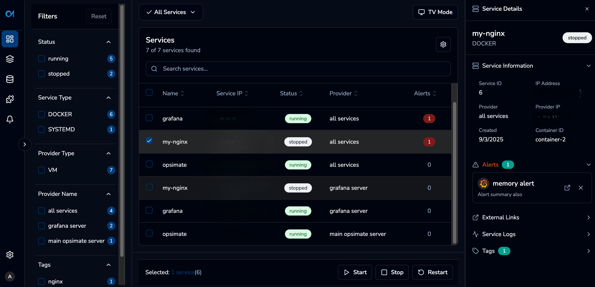
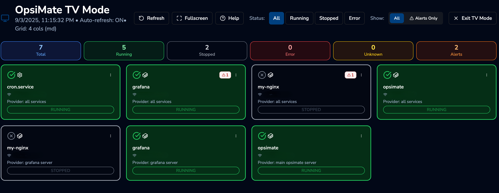

<p align="center">
  
</p>

<h1 align="center">OpsiMate</h1>
<p align="center"><b>One console for servers, Docker, and Kubernetes—discover, monitor, and act.</b></p>
<p align="center">
  Built for DevOps/NOC/IT teams that need a single place to see service health,
  jump to dashboards, and perform safe start/stop/restart operations.
</p>

<p align="center">
  <a href="https://img.shields.io/github/commit-activity/m/OpsiMate/OpsiMate">
    
  </a>
  <a href="https://github.com/OpsiMate/OpsiMate/releases">
    
  </a>
  <a href="https://github.com/OpsiMate/OpsiMate/blob/main/LICENSE">
    
  </a>
  <a href="https://github.com/OpsiMate/OpsiMate/stargazers">
    
  </a>
  <a href="https://join.slack.com/t/opsimate/shared_invite/zt-39bq3x6et-NrVCZzH7xuBGIXmOjJM7gA">
    
  </a>

</p>

<p align="center">
  <a href="https://opsimate.vercel.app/docs/getting-started/deploy">Get Started</a> ·
  <a href="https://opsimate.vercel.app/">Docs</a> ·
  <a href="https://www.opsimate.com/">Website</a> ·
  <a href="https://github.com/OpsiMate/OpsiMate/issues/new?labels=bug&template=bug_report.md">Report Bug</a>
</p>

---

### TL;DR
- 🔎 **Auto-discovery** of Docker/systemd services  
- 📊 **Live health & metrics** with Grafana/Prometheus/Kibana links  
- 🎛️ **Safe actions**: start/stop/restart from the dashboard  
- 🏷️ **Smart tags** for quick filtering

### Main Dashboard



### TV Mode



</br>

## Supported Infrastructure

### Compute Platforms

<table>
<tr>
    <td align="center" width="150">
        <br/>
        Docker
    </td>
    <td align="center" width="150">
        <br/>
        Kubernetes
    </td>
    <td align="center" width="150">
        <br/>
        Linux VMs
    </td>
</tr>
</table>

### Monitoring Integrations

<table>
<tr>
    <td align="center" width="150">
        <br/>
        Grafana
    </td>
  <td align="center" width="150">
      <br/>
      Datadog
  </td>
    <td align="center" width="150">
        <br/>
        Kibana
    </td>
</tr>
</table>


### Docker Deployment

Run OpsiMate locally quickly with Docker and a single command — no cloning or building required.

### Run OpsiMate with one command
#### Open your terminal and run:
```bash
curl -fsSL https://raw.githubusercontent.com/OpsiMate/OpsiMate/main/scripts/start-docker.sh | sh
```
**Access the application:**
- **Backend:** [http://localhost:3001](http://localhost:3001)
- **Client:** [http://localhost:8080](http://localhost:8080)


## Manual Docker Run
### OpsiMate now uses separate Docker images for frontend, backend (API), and worker (background jobs):

```bash
# Backend (API Server):
docker run -d \
  --name opsimate-backend \
  --rm \
  -p 3001:3001 \
  opsimate/backend
```

```bash
# Worker (Background Jobs - required for auto-refresh & alerts):
docker run -d \
  --name opsimate-worker \
  --rm \
  opsimate/backend node apps/server/dist/worker.js
```

```bash
# Frontend:
docker run -d \
  --name opsimate-frontend \
  --rm \
  -p 8080:8080 \
  opsimate/frontend
```

```bash
# We also support the old Monolith version:
docker run -d \
  --name opsimate \
  --rm \
  -p 3001:3001 -p 8080:8080 \
  opsimate/opsimate
```

**Access the application:**
- **Backend API:** [http://localhost:3001](http://localhost:3001)
- **Client UI:** [http://localhost:8080](http://localhost:8080)

> **Note:** The worker container runs background jobs for auto-discovery and alert polling. Both backend and worker should share the same database volume for proper operation.


### Volume Mounts (optional but recommended)

| Volume | Purpose | Required For |
|--------|---------|--------------|
| `/app/data/database` | SQLite database persistence | Backend + Worker |
| `/app/data/private-keys` | SSH private keys for authentication | Backend + Worker |
| `/app/config/config.yml` | Custom configuration | Backend + Worker |

### Example with volumes:

```bash
# Backend with volumes
docker run -d \
  --name opsimate-backend \
  --rm \
  -p 3001:3001 \
  -v $(pwd)/data/database:/app/data/database \
  -v $(pwd)/data/private-keys:/app/data/private-keys \
  -v $(pwd)/config.yml:/app/config/config.yml \
  opsimate/backend
```

```bash
# Worker with shared volumes
docker run -d \
  --name opsimate-worker \
  --rm \
  -v $(pwd)/data/database:/app/data/database \
  -v $(pwd)/data/private-keys:/app/data/private-keys \
  -v $(pwd)/config.yml:/app/config/config.yml \
  opsimate/backend node apps/server/dist/worker.js
```

> **💡 Tip:** Use `docker-compose` for easier management of all containers and shared volumes. See the [docker-compose.yml](docker-compose.yml) in the repository.

## Configuration

OpsiMate uses YAML configuration file


### Example Configuration

```yaml
# OpsiMate Configuration
server:
  port: 3001
  host: "0.0.0.0"

database:
  path: "/app/data/database/opsimate.db"

security:
  private_keys_path: "/app/data/private-keys"

vm:
  try_with_sudo: false
```

## Contributing

We welcome contributions to OpsiMate! Here's how you can help:

### Areas for Contribution

- **New Provider Support** - Add support for additional infrastructure platforms
- **New Integrations** - Extend alerting and metrics capabilities
- **UI/UX Improvements** - Enhance the dashboard and user experience
- **Performance Optimizations** - Improve scalability and responsiveness
- **Documentation** - Help improve guides and documentation

## Roadmap

### Upcoming Features

- **📈 Advanced Analytics** - Service performance trends and insights
- **🔄 GitOps Integration** - Infrastructure as Code workflows
- **🤖 AI-Powered Insights** - Intelligent anomaly detection and recommendations


## Support

- **[Documentation](https://opsimate.vercel.app/)** - Comprehensive guides and API reference
- **[GitHub Issues](https://github.com/opsimate/opsimate/issues)** - Bug reports and feature requests
- **[Slack Community](https://join.slack.com/t/opsimate/shared_invite/zt-39bq3x6et-NrVCZzH7xuBGIXmOjJM7gA)** - Join our discussions and get help
- **[Website](https://www.opsimate.com/)** - Learn more about OpsiMate

---

<div align="center">
  <p>Built with ❤️ by the OpsiMate team</p>
  <p>© 2025 OpsiMate. All rights reserved.</p>
</div> 

## 💖 Our Amazing Contributors

This project wouldn’t be what it is today without the incredible people who have shared their time, knowledge, and creativity.  
A huge thank you to everyone who has helped and continues to help make OpsiMate better every day! 🙌

 <a href="https://github.com/OpsiMate/OpsiMate/graphs/contributors">
  
</a>

---
